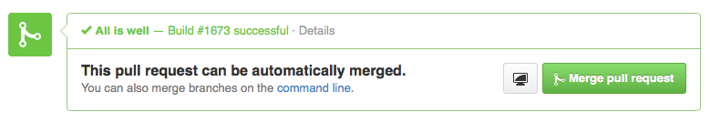
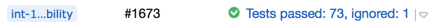

# TeamCity GitHub Status

Updates your Pull Request status from TeamCity builds.

**GitHub Pull Request status**

**TeamCity build status**

## Set-up

Make sure you have the [TeamCity WebHooks plugin](http://netwolfuk.wordpress.com/teamcity-plugins/tcwebhooks/) set-up and working first.

Create a `.env` file and set-up environment variables for:

 - `TEAMCITY_USERNAME`
 - `TEAMCITY_PASSWORD`
 - `TEAMCITY_PROTOCOL`
 - `TEAMCITY_BASE_URL`
 - `GITHUB_TOKEN`

Start up the server with `npm start` (or your preferred method of running NodeJS apps as a service).

Set-up web hooks in TeamCity to point to where ever the server is running, to the path `/github`, e.g.: If running on the same server as TeamCity, then you would use: `http://localhost:5000/github`
